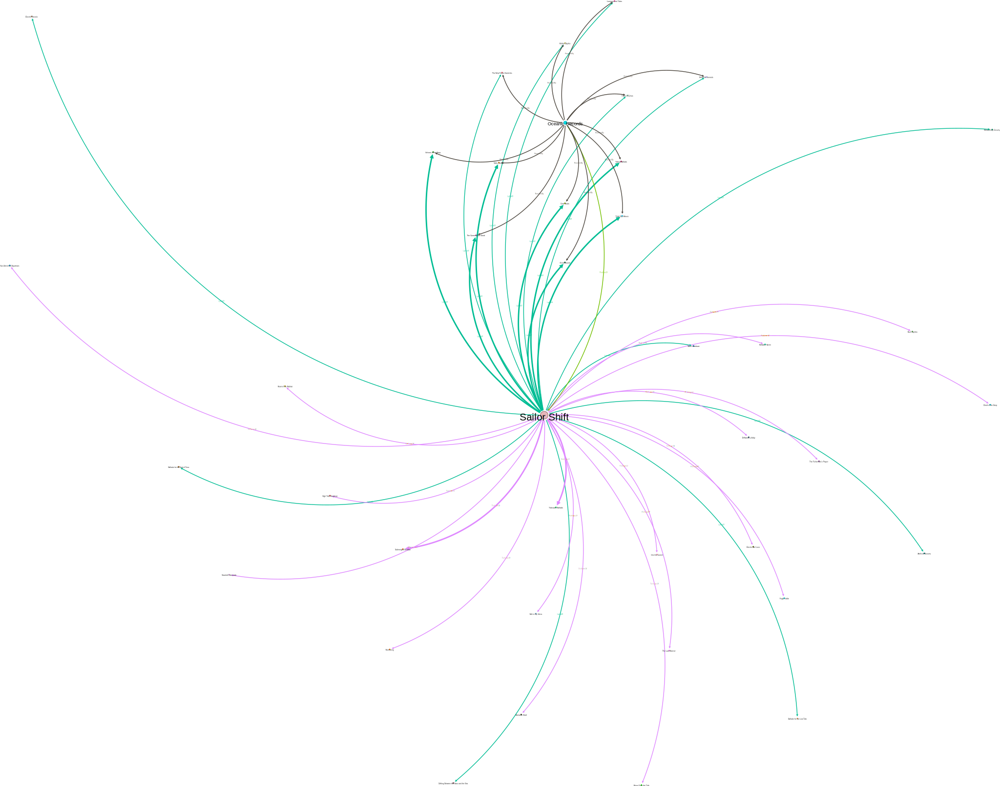
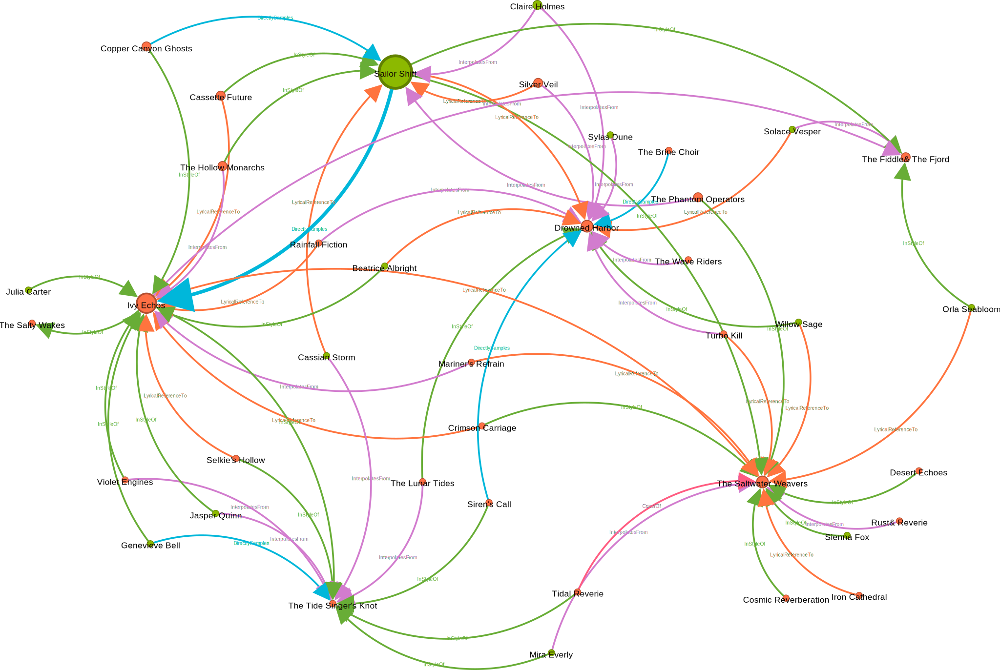
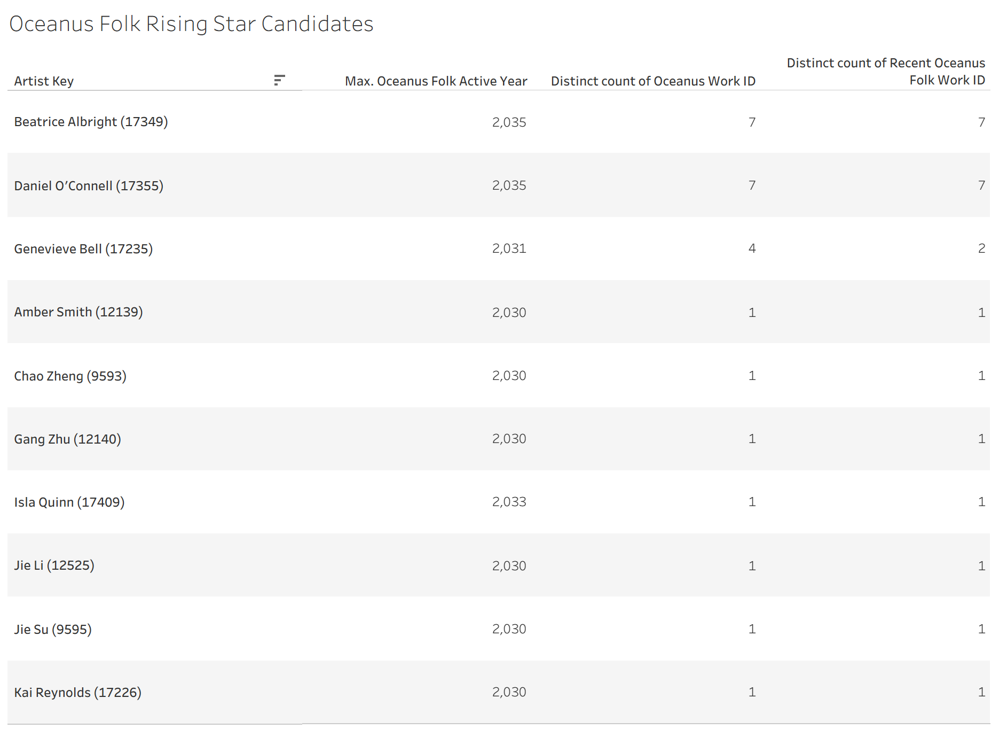

This section will detail the analysis we performed and the results we obtained.

We will present the visualizations we created and discuss the insights we gained from them, addressing the research questions outlined in our project proposal.

### 1. Sailor Shift Influence Network

<iframe src="gephi/network/index.html" width="100%" height="600px" style="border: 1px solid #ccc; border-radius: 8px;">

</iframe>

The Sailor Shift Influence Network is a directed graph that illustrates the influence relationships between Sailor Shift and other entities that it interacts with. Each node represents an entity, and the directed edges indicate the direction of influence. The size of the nodes corresponds to their degree of influence, while the color coding helps to differentiate differentiate the names of the entities.

### (a) Who has she been most influenced by over time?

{width="100%" height="100%"}

This graph examines the foundational roots of Sailor Shift’s musical style. It reveals that her record-breaking sound did not emerge in a vacuum; rather, it evolved directly from her early collaborative work. **Ivy Echoes** stands out as the most significant node in her early network. Rather than being an external 'older' influence, this represents her own former band (active 2023–2026). The graph proves that her 2028 solo breakthrough was built heavily upon the stylistic foundation, catalog, and collaborative network she initially developed during her time with the group.

### (b) Who has she collaborated with and directly or indirectly influenced?

#### Professional Network

{width="100%" height="100%"} While Sailor Shift maintained creative independence, she did not operate entirely on her own. The massive **Oceanic Records** node stands out as the largest hub in her professional network. The *ProducerOf* arrow pointing from the label to Sailor Shift reveals that her independent style was supported by major institutional power. Oceanic Records acted as the **financial and production engine** that distributed her music, giving her the massive platform needed to become a "Super-Hub" and influence the rest of the folk genre.

#### Directly or Indirectly Influenced

{width="100%" height="100%"} While her working circle was small, her creative impact was **huge**. This graph shows a large ring of arrows pointing toward her, representing artists who cover her songs or copy her style. It proves that she became a **"Super-Hub"**. Hundreds of younger musicians used her sound as a blueprint to build their own careers, even if they never actually met or worked with her.

### (c) How has she influenced collaborators of the broader Oceanus Folk community?

{width="100%" height="100%"} By filtering the network exclusively for the Oceanus Folk genre, at max hops, we reveal the structural backbone of the music itself. This visualisation maps how Sailor Shift's catalogue is woven into the broader discography of the genre.

- **The Tangled Core**: The dense web of connected nodes represents a highly referential body of work. Within the Oceanus Folk genre, songs and albums are deeply intertwined through covers, lyrical references, and shared album structures. Sailor Shift's catalog sits firmly within this core, proving her music is a foundational part of the genre's shared canon.

- **The Standalone Tracks**: The isolated nodes floating around the perimeter represent standalone works. These are specific Oceanus Folk songs or albums connected to Sailor Shift that exist independently, without musically referencing or being referenced by the rest of the genre's catalog.

Ultimately, this visual shifts the focus from professional networking to musical legacy, proving that Sailor Shift's body of work is deeply embedded in the referential fabric of the Oceanus Folk genre.

### 2. Oceanus Folk Influence Across the Musical World

This section examines how Oceanus Folk spread across the wider musical world, whether that spread was gradual or intermittent, which genres and artists were most influenced, and how the genre itself evolved after Sailor Shift’s 2028 breakthrough.

### (a) Was this influence intermittent or did it have a gradual rise?

<iframe src="https://public.tableau.com/views/ProjectAnalysisDashboard1/Dashboard1?:showVizHome=no" width="100%" height="750px" style="border: 1px solid #ccc; border-radius: 8px;">

</iframe>

Oceanus Folk’s influence shows a mixed diffusion pattern: it rose gradually overall, but that rise happened through intermittent spikes rather than a smooth, even increase. The left chart shows that Oceanus Folk’s outward influence on other genres was not steady year by year. In the early period, influence remained very low, with only one or two unique non-Oceanus works referencing Oceanus Folk in most years, suggesting that the genre initially had only limited reach outside its own musical space. The first clear breakthrough appears around 2017, when influenced works jump noticeably. After that, the pattern becomes much more volatile, with sharp peaks in 2023, 2027, and 2029 rather than a continuous upward climb. This indicates that the spread was intermittent in its yearly expression, with bursts of strong adoption followed by declines.

However, the cumulative chart adds an important second perspective. Although the yearly pattern is uneven, the cumulative curve rises throughout the period, especially from the early 2020s onward. This shows that Oceanus Folk’s influence was still building over time overall, even if that growth did not happen smoothly each year. The steepest cumulative growth occurs in the late 2020s, indicating that this was the most important phase in the genre’s wider diffusion across the musical world. Sailor Shift’s 2028 breakthrough sits directly within this strongest growth period. While the highest annual peak appears just before 2028, the years around her rise remain the period of greatest overall expansion, suggesting that her emergence likely coincided with and reinforced Oceanus Folk’s broader spread into other musical communities.

### (b) What genres and top artists have been most influenced by Oceanus Folk?

<iframe src="https://public.tableau.com/views/ProjectAnalysisDashboard2/Dashboard2?:showVizHome=no" width="100%" height="750px" style="border: 1px solid #ccc; border-radius: 8px;">

</iframe>

The dashboard shows that Oceanus Folk’s influence is concentrated most strongly in a small number of genres. **Dream Pop** and **Indie Folk** emerge as the leading recipients of Oceanus Folk influence, followed by **Desert Rock** and **Space Rock**, indicating that the genre spread most successfully into a few key stylistic communities rather than evenly across the entire musical world. A second tier of adoption appears in genres such as **Synthwave**, **Americana**, and **Doom Metal**, while lower-count genres reflect weaker but still visible diffusion beyond the core receiving group.

At the artist and group level, the pattern is broader than it is deep. The strongest uniquely identified artist/group nodes record only a small number of distinct influenced works, showing that Oceanus Folk did not overwhelmingly shape one dominant artist community. Instead, its influence appears to have been distributed across a cluster of artists and groups, each adopting the style in a modest number of works. This suggests that Oceanus Folk spread widely across the musical world, but with its artist-level effects dispersed rather than concentrated in a few major adopters.

### (c) On the converse, how has Oceanus Folk changed with the rise of Sailor Shift? From which genres does it draw most of its contemporary inspiration?

<iframe src="https://public.tableau.com/views/ProjectAnalysisDashboard3/Dashboard3?:showVizHome=no" width="100%" height="750px" style="border: 1px solid #ccc; border-radius: 8px;">

</iframe>

This dashboard shows that Oceanus Folk’s inspirations changed substantially after Sailor Shift’s 2028 breakthrough, becoming broader and more contemporary while still retaining a strong **Indie Folk** foundation. Before 2028, the genre was overwhelmingly driven by Indie Folk, with additional influence from **Synthwave, Doom Metal, Synthpop, and Dream Pop**, indicating a relatively concentrated stylistic base. After 2028, although Indie Folk remained the dominant influence, Oceanus Folk drew inspiration from a much wider range of genres, especially **Dream Pop, Indie Rock, Alternative Rock, Psychedelic Rock, Americana, and Desert Rock**. The ranking of post-2028 inspiration genres confirms that contemporary Oceanus Folk is no longer shaped by a single dominant tradition alone, but by a more varied and hybrid mix of genres. Overall, the dashboard suggests that Sailor Shift’s rise coincided with Oceanus Folk becoming more experimental, cross-genre, and musically expansive, while still remaining rooted in its original Indie Folk core.

### 3. Rising Star in the Music Industry

### (a) Visualize the careers of three artists. Compare and contrast their rise in popularity and influence.

The three artists were not chosen randomly. They were selected to represent three different career trajectories so that the comparison could be used to define what a rising star looks like in this dataset.

**Selected artists**

- **Sailor Shift** — benchmark superstar\
- **Szymon Pyć** — steady long-term builder\
- **Sienna Fox** — emerging momentum artist

::: {style="margin: 1rem 0;"}
<iframe src="https://public.tableau.com/views/ProjectAnalysisDashboard4/Dashboard4?:showVizHome=no" width="100%" height="800" frameborder="0" allowfullscreen>

</iframe>
:::

The three career visualizations suggest that a rising star is not defined by output alone. A stronger profile combines three signals: growing career output, rising popularity through notable works, and expanding influence as later works begin referencing the artist’s music. In other words, a rising star is someone who not only produces more work, but also converts that output into recognition and then into broader influence.

Comparing the three artists shows three distinct career trajectories.

**Sailor Shift** represents the breakout benchmark. Her career output rises quickly from 2028 onward, while both her popularity and influence also grow steeply within a relatively short time window. This is the clearest breakout pattern: strong output, strong notable-work growth, and rapid accumulation of later references. She is the model of a superstar whose career accelerates quickly and whose influence expands beyond her own catalogue.

**Szymon Pyć** provides the contrast case of a long, steady career. His output, popularity, and influence all increase gradually across a much longer period, beginning in the late 1980s and continuing into the 2020s. Unlike Sailor Shift, his rise is not driven by a sudden surge. Instead, it is built through sustained output and cumulative recognition over decades. This makes him a useful steady-growth benchmark: successful, respected, and influential, but without the compressed upward momentum of a breakout star.

**Sienna Fox** represents the high-momentum emerging pattern. Her career is much shorter, but within that short span her output rises quickly, her number of notable works also grows strongly, and her influence begins appearing early. Although her total counts are still below those of Sailor Shift and Szymon Pyć, the speed of her development is important. She shows the early-stage version of a breakout profile: recent entry, fast accumulation of work, high notable-work conversion, and the beginning of influence growth.

Taken together, the three charts suggest that a rising star in this music ecosystem is best identified by rate of growth, not just career length. Sailor Shift shows the fully developed breakout model, Szymon Pyć shows long-term steady accumulation, and Sienna Fox shows the emerging high-momentum pattern that may signal the next wave of stardom.

### (b) Using this characterization, give three predictions of who the next Oceanus Folk stars will be over the next five years

To make the prediction defensible, the next stars should come from the **Oceanus Folk Rising Star Candidates** table rather than from the comparison chart alone. That shortlist filters to solo artists, valid artist works, and recent Oceanus Folk activity, so it identifies artists who are actually emerging within Oceanus Folk itself.

Based on the rising-star profile, the next Oceanus Folk stars are predicted to be **Beatrice Albright**, **Daniel O’Connell**, and **Genevieve Bell**. These artists show the strongest recent momentum within Oceanus Folk, measured through recent release activity, notable works, and continued recent presence in the genre. Like Sailor Shift in her breakout phase, they combine visibility with upward trajectory, suggesting that they are the most likely acts to expand Oceanus Folk’s reach over the next five years.