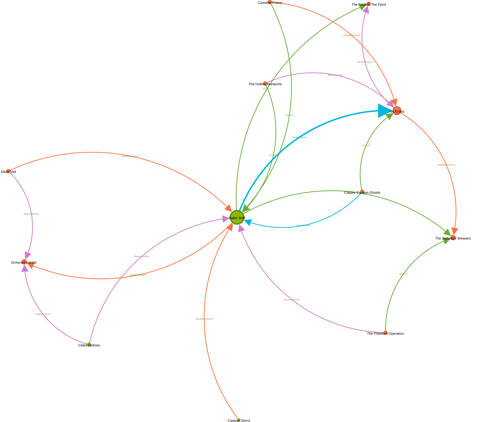
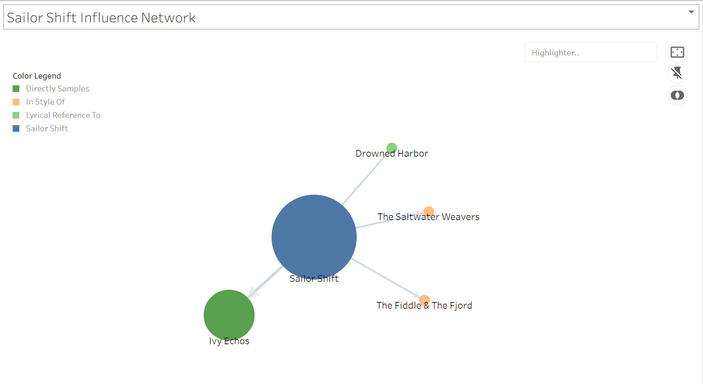
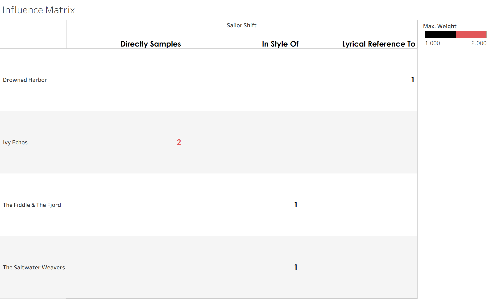
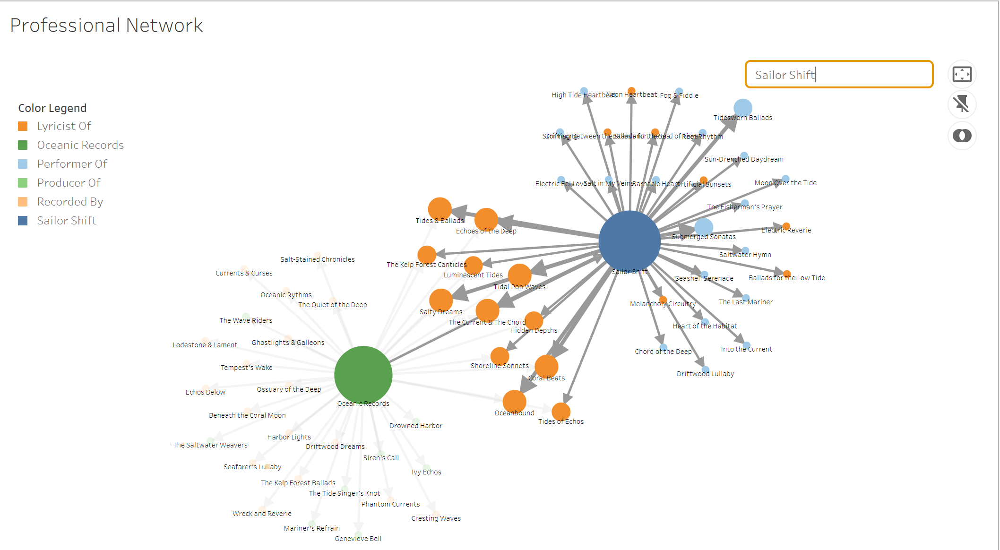
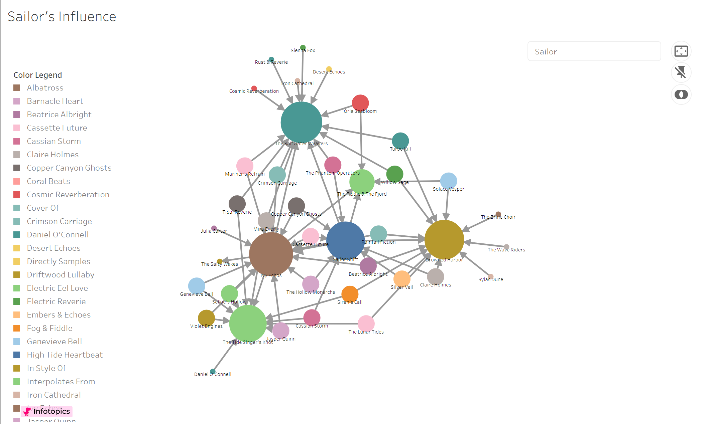
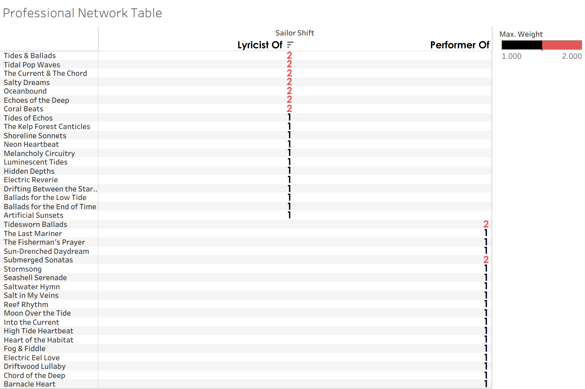
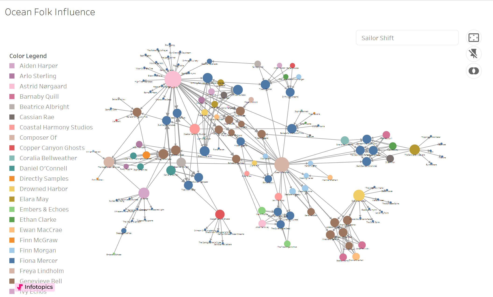

This section will detail the analysis we performed and the results we obtained.

We will present the visualizations we created and discuss the insights we gained from them, addressing the research questions outlined in our project proposal.

### 1. Sailor Shift Influence Network ###
<iframe 
  src="gephi/network/index.html" 
  width="100%" 
  height="600px" 
  style="border: 1px solid #ccc; border-radius: 8px;">
</iframe>

The Sailor Shift Influence Network is a directed graph that illustrates the influence relationships between Sailor Shift and other entities that it interacts with. Each node represents an entity, and the directed edges indicate the direction of influence. The size of the nodes corresponds to their degree of influence, while the color coding helps to differentiate differentiate the names of the entities.

### (a) Who has she been most influenced by over time? ###

<!-- 
{width=100% height=500px} -->

{width=100% height=100%}
<!-- {width=100% height=400px} -->

Based on the size of the nodes in the graph, we identify that Ivy Echos had the most influence on Sailor Shift. The larger the node, the more influential it is in terms of influencing Sailor Shift's career and musical style. And based on the edge type, it seems that Sailor Shift Directly Samples quite often from Ivy Echos. This suggests that Ivy Echos played a significant role in shaping Sailor Shift's artistic development and may have had a strong impact on her musical direction and success.

### (b) Who has she collaborated with and directly or indirectly influenced? ###
#### Professional Network ####
<!-- <iframe 
  src="gephi/network2/index.html" 
  width="100%" 
  height="600px" 
  style="border: 1px solid #ccc; border-radius: 8px;">
  
</iframe> -->
{width=100% height=100%}
Based on the size of the nodes in the graph, we identify that Sailor Shift has collaborated most frequently with a few professionals, as indicated by the larger node size and the weights seen in the table. The edge types indicate that the collaborations were mostly in the form of "LyricistOf" or "PerformerOf" relationships. This suggests that Sailor Shift has had a significant impact on the music created by these professionals, and that her influence extends beyond just her own music to the work of others in the industry.

#### Directly or Indirectly Influenced ####
{width=100% height=100%}
<!-- {width=100% height=100%} -->

### (c) How has she influenced collaborators of the broader Oceanus Folk community? ###
{width=100% height=100%}

