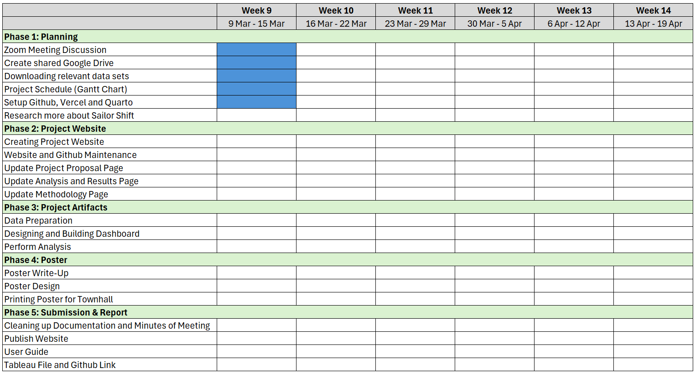

# Project Motivation

This project is motivated by the need to examine how Sailor Shift’s rise from a local Oceanus Folk artist to an internationally recognised musician reflects broader processes of artistic influence, collaboration, and genre transformation. Her career provides a valuable case through which to study not only individual success, but also the ways in which a regional musical tradition can gain wider cultural visibility and reshape the contemporary music landscape.

The study is further motivated by the analytical potential of knowledge graph data, which captures relationships among artists, albums, songs, genres, collaborations, and influences over time. By applying visual analytics to this interconnected data, the project seeks to produce a clearer understanding of Sailor Shift’s development, the spread of Oceanus Folk, and the conditions that may give rise to the next generation of prominent artists within this musical community.

# Project Objective and Research Questions

## Project Objective

The objective of this project is to develop a visual analytics website that examines Sailor Shift’s career trajectory, analyses the spread and evolution of Oceanus Folk, and identifies artists who demonstrate strong potential to emerge as future Oceanus Folk stars.

## Research Questions

1.  How did Sailor Shift’s career develop over time in terms of collaborations, genre transitions, and growth in prominence?

2.  Which artists and genres influenced Sailor Shift, and whom has she directly or indirectly influenced in return?

3.  How has Oceanus Folk spread across the wider music landscape, and did this influence develop gradually or through key turning points?

4.  Which genres and major artists have been most significantly influenced by Oceanus Folk?

5.  How has Oceanus Folk evolved during Sailor Shift’s rise, and which genres now shape its contemporary form?

6.  What characteristics define a rising star within this music ecosystem, and which three artists appear most likely to become the next prominent Oceanus Folk stars over the next five years?

# Scope of Work

This project will focus on the visual analysis of a music knowledge graph containing information on artists, albums, songs, genres, collaborations, and influence relationships.

The work will begin with data understanding and preparation, followed by the development of visualizations that profile Sailor Shift’s career and highlight important stages in her artistic development. It will then examine her collaboration and influence networks in order to identify the relationships that shaped her rise and the extent of her impact on other artists and the broader Oceanus Folk community.

The project will also investigate how Oceanus Folk has spread into other musical contexts and how the genre itself has evolved over time. In addition, it will compare the careers of three selected artists to identify shared characteristics associated with emerging success. Based on these patterns, the project will provide three evidence-based predictions of potential future Oceanus Folk stars. The overall emphasis will be on clear, interpretable, and well-supported visual analysis rather than complex predictive modelling.

# Project Schedule (Gantt Chart)

   