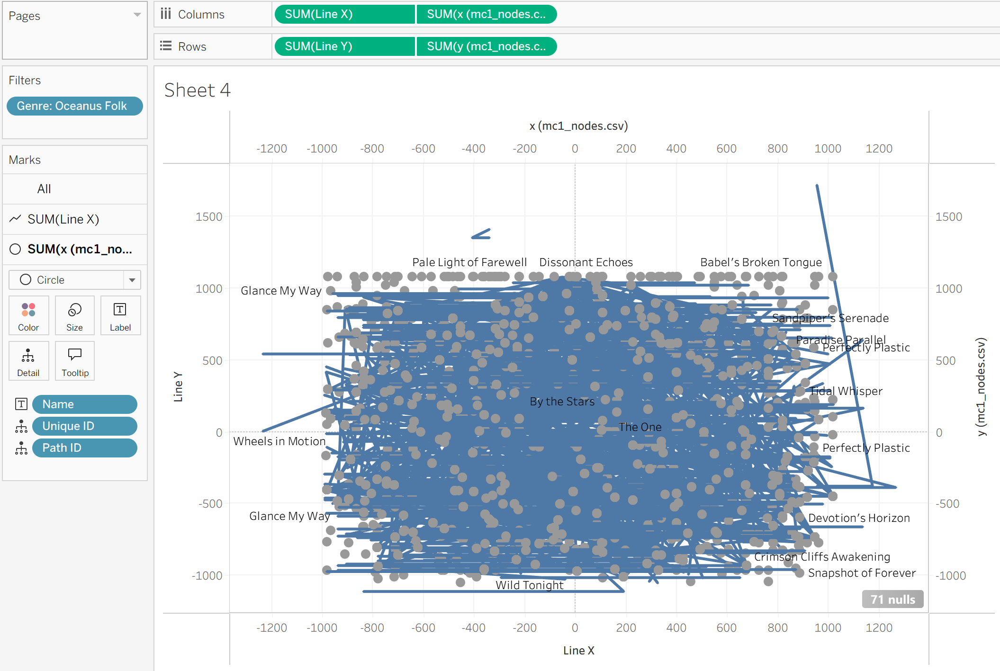
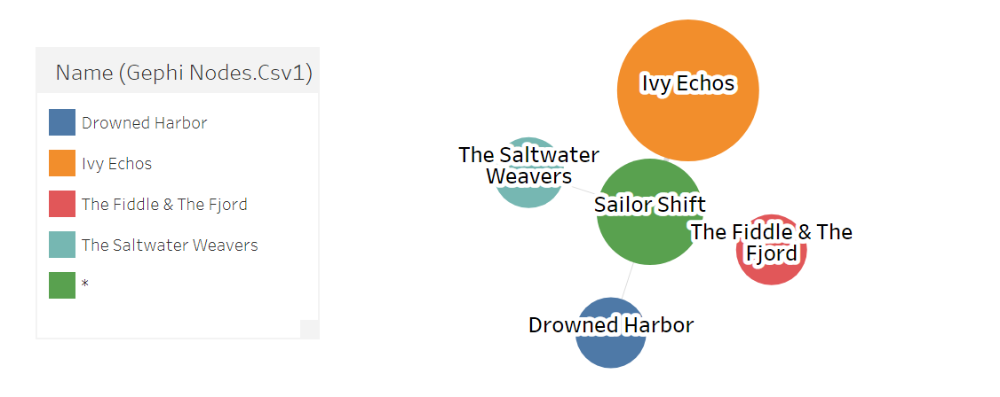
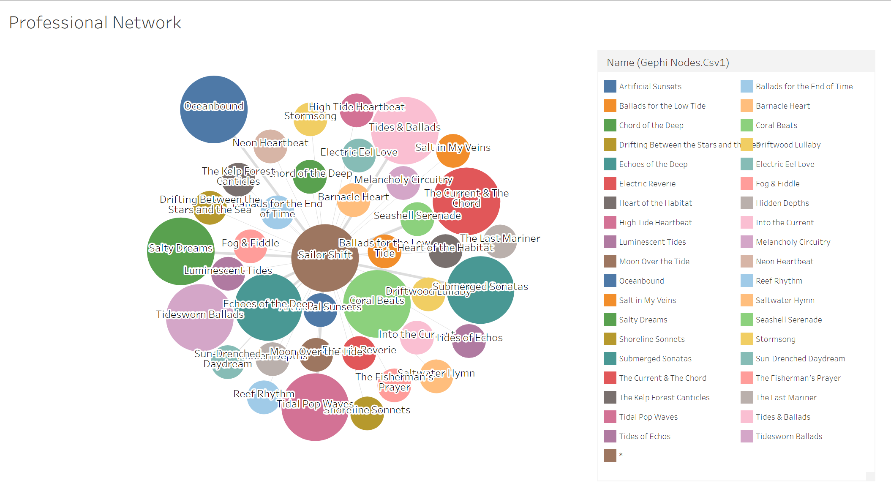

This section will showcase the prototypes of our visual analytics application.

We will include initial sketches, wireframes, and interactive prototypes that we develop throughout the project.

---
title: "Prototypes & Iterations"
description: "Documenting the design process, analytical hurdles, and visual iterations that led to the final project dashboards."
toc: true
---

## The Value of Iteration

Visual analytics is rarely a straight line from raw data to a finished dashboard. Throughout this project, several initial prototypes were discarded or heavily iterated upon after testing revealed that they either misrepresented the data or failed to answer the core research questions effectively.

Below is a breakdown of the specific analytical hurdles we faced for Question 1 and Question 3, and how iterating our prototypes led to the final visual solutions.

------------------------------------------------------------------------

## Iterations for Question 1: Mapping the Ecosystem

Our goal for Question 1 was to map the internal topology of the Oceanus Folk genre and isolate Sailor Shift's foundational network. Our approach to visualising this network required three distinct iterations.

### Iteration 1: The Tableau Coordinate Approach

Our initial prototype attempted to build the entire Ego Network directly within Tableau. Because Tableau is not a native graph-rendering engine, this required manually engineering a dataset with calculated X and Y coordinates to force Tableau to draw nodes and edges. \* **The Problem:** While technically possible, this prototype resulted in a highly rigid, static visual. The manual coordinate calculations were computationally heavy, and the resulting "hairball" was difficult for a user to navigate or interpret, defeating the purpose of an interactive visual analytics tool.

### Iteration 2: Tableau Diagram Chart Extension

Realising that manually calculating coordinates was inefficient, we pivoted to using **Gephi** strictly as a data-filtering engine. We anchored the graph on Sailor Shift, extracted her specific Ego Network, and exported this cleaned, filtered node/edge list back into Tableau. We then utilised a Tableau Diagram/Network Extension to render the graph. \* **The Problem:** While the extension successfully drew the network without requiring manual X/Y coordinates, it introduced severe performance bottlenecks. Tableau dashboard extensions often struggle to render dense, multi-relational graphs smoothly. Furthermore, the extension lacked the native physics layouts (like ForceAtlas2) and deep interactive customisations required to make the hairball legible, resulting in a clunky user experience.

 

### Iteration 3 (Final): Sigma.js Interactive Integration

To solve the interactivity problem, we bypassed Tableau entirely for this specific question. We utilised the **Sigma.js exporter plugin** directly within Gephi. \* **The Solution:** This generated a self-contained, lightweight HTML/JavaScript application that preserved all of Gephi's structural math while adding dynamic user controls (zooming, panning, and click-to-highlight). We then embedded this interactive widget directly into our Quarto website as our final solution for Question 1.

## Iterations for Question 2: Tracing the Spread of Oceanus Folk

Our goal for Question 2 was to understand how Oceanus Folk spread across the broader music world, identify which genres and artists were most influenced by it, and examine how the genre itself changed after Sailor Shift’s rise. Unlike Question 1, which focused on a specific ego network, Question 2 required us to work at the community and genre level. This created several analytical challenges around edge direction, double-counting, and how to clearly separate outward influence from inward inspiration.

### Iteration 1: The Raw Influence Count Prototype

Our initial prototype attempted to answer the question by simply filtering the five influence-related edge types (`InStyleOf`, `InterpolatesFrom`, `CoverOf`, `DirectlySamples`, and `LyricalReferenceTo`) and plotting the total number of influence connections over time.

- **The Problem:** This first version was too crude. A single song could reference multiple Oceanus Folk works, which inflated the counts and made the spread look larger than it actually was. More importantly, the chart mixed together different directions of influence. It did not clearly distinguish between:
  - **other genres being influenced by Oceanus Folk**, and
  - **Oceanus Folk drawing inspiration from other genres**.

As a result, the prototype produced noisy trends and could not answer whether the spread was truly gradual or just an artifact of repeated references.

### Iteration 2: The One-View Genre Ranking Prototype

To improve clarity, we next grouped the influence data by genre and ranked the top genres and artists associated with Oceanus Folk references. This produced an early genre-ranking and top-artist prototype in Tableau.

- **The Problem:** While the ranking view was more readable, it still contained two major analytical issues.\
  First, it treated all influence links as equal, which meant internal Oceanus Folk-to-Oceanus Folk references could dominate the results and hide the genre’s outward spread to the rest of the music world.\
  Second, the artist view was misleading because some artists shared the same name, and grouping by name alone merged different artist IDs together. In addition, counting raw role-level links rather than distinct works sometimes overstated an artist’s apparent influence.

This prototype was useful in revealing broad patterns, but it was not yet rigorous enough for final interpretation.

### Iteration 3 (Final): The Directional Diffusion Dashboard

To solve these issues, we redesigned the analysis around **directional influence logic**. Instead of treating all influence links the same way, we split the problem into two separate analytical flows:

- **Outward Influence from Oceanus Folk**
  - `target genre = Oceanus Folk`\
  - `source genre ≠ Oceanus Folk`\
    This captures cases where non-Oceanus works were influenced by Oceanus Folk.
- **Inward Inspiration into Oceanus Folk**
  - `source genre = Oceanus Folk`\
  - `target genre ≠ Oceanus Folk`\
    This captures cases where Oceanus Folk itself was borrowing from other genres.
- **The Solution:** This directional redesign led to three final views:
  1.  a **time diffusion view** showing whether Oceanus Folk spread gradually or intermittently,
  2.  a **genre and artist adoption view** showing which parts of the music world were most influenced by Oceanus Folk,
  3.  a **before/after 2028 inspiration comparison** showing how Oceanus Folk evolved after Sailor Shift’s breakthrough.

We also replaced raw edge counts with **distinct influenced works** wherever possible to avoid overcounting repeated references. For artists, we used unique artist identifiers rather than names alone to avoid merging different people with the same label.

This final structure allowed us to answer all three sub-questions clearly: how Oceanus Folk spread, who adopted it most strongly, and how the genre itself became more hybrid in the Sailor Shift era.

## Iterations for Question 3: Predicting Rising Stars

Question 3 required us to define the characteristics of a rising star and predict the next industry leaders. This section required the most significant pivot of the entire project, as our initial mathematical hypothesis proved to be flawed.

### Iteration 1: The Structural Network Hypothesis

Our initial assumption was that "influence" is best measured by network topology. We used Gephi to calculate standard centrality metrics for the entire dataset: \* **PageRank:** To measure elite institutional influence. \* **In-Degree:** To measure how often an artist was covered or sampled. \* **Out-Degree (Node Size):** To measure their historical output.

### Iteration 2: The Scatter Plot Prototype

We exported these Gephi metrics into Tableau and built a scatter plot prototype. The goal was to find the "rising stars" by looking for artists with high PageRank and low Out-Degree. \* **The Problem:** When we plotted the data, we discovered a massive "newcomer blindspot." Brand-new artists were completely isolated in the bottom-left corner of the chart with zero PageRank. We realised that network math is a **lagging indicator**; because it takes years for other artists to copy a newcomer's style, purely structural metrics inherently punish emerging talent and heavily favor established veterans.

> *\[Insert your scatter plot screenshot here! This is the crucial visual. Name it: ``\]*

### Iteration 3 (Final): The Momentum Pivot

Because our Gephi prototype proved that structure cannot predict real-time breakouts, we completely scrapped the scatter plot. We pivoted our methodology from "Structural Analytics" to "Momentum Analytics." \* **The Solution:** Using Tableau, we engineered a temporal dataset that bypassed lagging network edges. Instead, we filtered for artists who debuted recently and ranked them by the sheer volume and velocity of their **Recent Notable Works**. This final prototype successfully bypassed the structural lag and accurately identified high-momentum newcomers like Min Qin and Carlos Duffy.

> *\[Insert a screenshot of Ewan's early/unpolished Tableau bar chart here. Name it: ``\]*