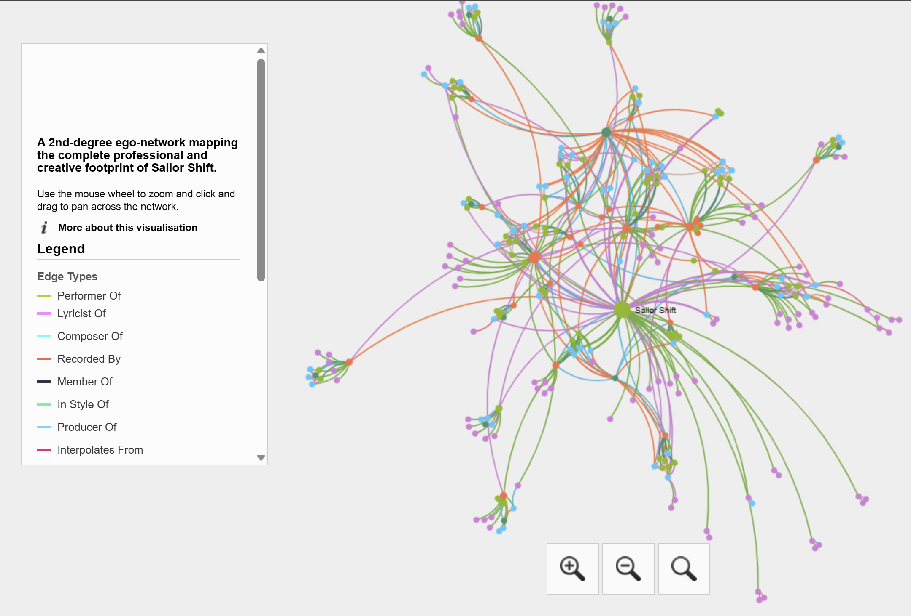
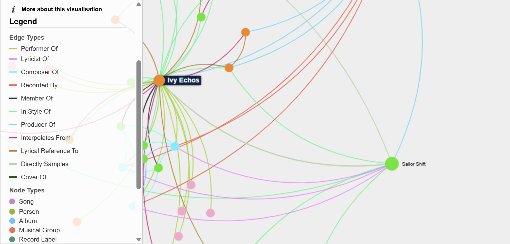
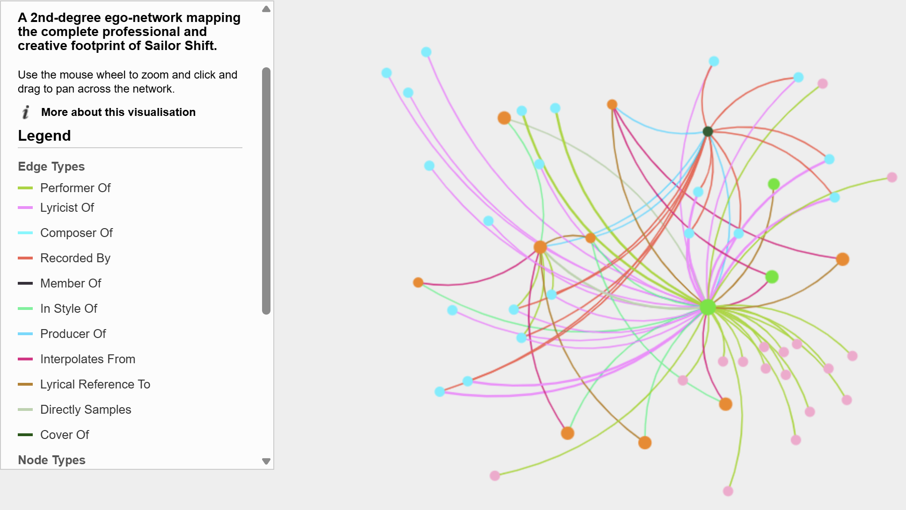

In this section, we will present the storyboards that guide the user experience of our visual analytics tool.

Our storyboards will illustrate how users can interact with the visualizations to gain insights into the music knowledge graph.

## Storyboard for Question 1: Structural Position of Sailor Shift

The goal of this analysis was to untangle the dense music industry knowledge graph to answer a micro-level question: *What are the roots, collaborators, and indirect creative reach of Sailor Shift within the Oceanus Folk genre?* Rather than looking at raw album sales, we sought to map the physical structure of the music itself to understand how her record-breaking sound was developed.

### The Visual Approach: Interactive Ego Network

Because static diagrams fail to capture the complexity of thousands of musical connections, we generated a dynamic **Sigma.js Interactive Network**. 

By anchoring an Ego Network specifically on Sailor Shift (Node ID = 17255) at maximum depth, and intersecting it with the Oceanus Folk genre, we stripped away the industry noise. The resulting visualization allows users to physically explore the structural core of the genre's discography. 

*(Note: To explore the live graph, please see the Interactive Graph section. The findings below highlight the key discoveries from this visual model.)*

---

### Key Findings

#### Step 1. The Collaborative Core vs. The Independent Periphery
When viewing the network from a macro level via the ForceAtlas2 layout, a distinct topological pattern emerges. The Oceanus Folk genre is not evenly distributed. 

* **Visual Evidence:** The center of the graph forms a dense, highly entangled "hairball" of nodes connected by thick structural edges, while dozens of smaller artist clusters float completely disconnected on the periphery.
* **The Insight:** This proves that the mainstream success of the genre is driven by a highly referential, collaborative core of artists who frequently perform, cover, and write together. The independent artists on the periphery, while sharing the genre tag, do not contribute to the structural momentum of the core sound. 

> 

#### Step 2. The Ivy Echoes Origin Story
By utilizing the interactive search and click-to-highlight features, we isolated Sailor Shift’s direct connections to determine her biggest inspirations. 

* **Visual Evidence:** The graph reveals a massive, heavily weighted cluster of connections between Sailor Shift and the entity **Ivy Echoes**. Initially, purely structural analysis might suggest Ivy Echoes was an older mentor band that inspired her.
* **The Insight:** By cross-referencing the network topology with historical context, we discovered that Ivy Echoes is actually Sailor Shift's *own former band* (active 2023–2026). The graph proves that her 2028 solo breakthrough did not happen in a vacuum; it was built directly upon the stylistic foundation, catalog, and collaborative network she initially developed during her time with Maya, Lilly, Jade, and Sophie.

> 

#### Step 3. A Culture of Musical Referencing
By selecting nodes within the central cluster, we can analyze the specific types of relationships that define the genre's internal growth.

* **Visual Evidence:** When a central work is selected, the network highlights a dense web of connections. While `PerformerOf` links artists to their music, a significant portion of the internal structure is built on `CoverOf` and `InStyleOf` relationships. 
* **The Insight:** Sailor Shift's legacy is defined by a culture of stylistic continuity. The genre remains tightly knit because artists are constantly covering her foundational works or releasing music explicitly marked as being in her style. This creates a "structural echo" that keeps her early work relevant decades after its release.

> 

---

## Storyboard for Question 2: Spread and Evolution of Oceanus Folk

### Step 1: Understanding the spread over time
Silas begins with the **Influence Over Time** view. He hovers over the yearly and cumulative trend lines to see how many unique works were influenced by Oceanus Folk each year.

**User goal:** Determine whether Oceanus Folk spread gradually or intermittently.

**Expected insight:** Oceanus Folk’s influence rises gradually overall, but with noticeable bursts of expansion rather than a perfectly smooth trend.

### Step 2: Identifying the most influenced genres
Silas then moves to the **Top Genres Influenced by Oceanus Folk** chart. By comparing bar lengths and hovering over each genre, he identifies which parts of the music world adopted Oceanus Folk most strongly.

**User goal:** Discover which genres were most influenced by Oceanus Folk.

**Expected insight:** Oceanus Folk spread most strongly into compatible genres such as Indie Folk and Dream Pop, while also reaching a wider mix of styles over time.

### Step 3: Identifying the most influenced artists
Next, Silas explores the **Top Artists Influenced by Oceanus Folk** chart. He reads the ranked artist list to see which performers most frequently produced works influenced by Oceanus Folk.

**User goal:** Find the artists who most clearly absorbed Oceanus Folk influence.

**Expected insight:** Oceanus Folk’s impact is not limited to one or two artists, but is distributed across several performers in the wider music ecosystem.

### Step 4: Comparing Oceanus Folk before and after Sailor Shift
Silas then examines the **Before vs After 2028 Inspiration** chart. He compares the genre bars across the two periods to see how Oceanus Folk’s own inspirations changed after Sailor Shift’s breakthrough.

**User goal:** Understand how Oceanus Folk evolved with the rise of Sailor Shift.

**Expected insight:** Oceanus Folk remained rooted in Indie Folk, but became more hybrid after 2028 by drawing more inspiration from Dream Pop, Indie Rock, Alternative Rock, and other adjacent genres.

### Step 5: Interpreting contemporary inspiration
Finally, Silas checks the **Top Contemporary Inspiration Genres** chart to focus only on the post-2028 period.

**User goal:** Identify the strongest present-day inspiration sources for Oceanus Folk.

**Expected insight:** Contemporary Oceanus Folk is still anchored in Indie Folk, but now also draws strongly from Dream Pop, Indie Rock, and Alternative Rock.

---

## Storyboard for Question 3: Rising Star Profile and Prediction

### Step 1: Comparing career output
Silas begins with the **Career Output Over Time** chart. He compares the cumulative release trajectories of three selected artists: **Sailor Shift**, **Szymon Pyć**, and **Sienna Fox**.

**User goal:** Understand how different artists build their careers over time.

**Expected insight:** Sailor Shift shows rapid expansion, Szymon Pyć shows long-term steady growth, and Sienna Fox shows strong recent momentum.

### Step 2: Comparing popularity growth
Silas moves to the **Popularity Growth Over Time** chart, which tracks cumulative notable works.

**User goal:** See how recognition develops across different career paths.

**Expected insight:** Sailor Shift converts her output into recognition quickly, Szymon Pyć builds recognition steadily across a long span, and Sienna Fox shows early but promising growth.

### Step 3: Comparing influence growth
Silas then studies the **Influence Growth Over Time** chart to see how each artist’s work begins to influence later artists.

**User goal:** Compare the broader industry impact of the three career trajectories.

**Expected insight:** Szymon Pyć has the strongest long-term influence, Sailor Shift shows fast-growing influence in a shorter period, and Sienna Fox is still in the early phase of building impact.

### Step 4: Defining the rising-star profile
After comparing the three charts together, Silas summarizes the shared characteristics of a rising star.

**User goal:** Form a clear definition of what makes an artist a rising star in this dataset.

**Expected insight:** A rising star is not defined by output alone, but by a combination of recent activity, growing notable works, and an upward influence trajectory.

### Step 5: Predicting the next Oceanus Folk stars
Finally, Silas reviews the **Oceanus Folk Rising Star Candidates** table, which ranks recent Oceanus Folk artists by recent works, recent notable works, and recency of activity.

**User goal:** Identify the strongest candidates to become the next Oceanus Folk stars.

**Expected insight:** Artists such as **Beatrice Albright**, **Daniel O’Connell**, and **Genevieve Bell** emerge as the strongest next-generation candidates because they best match the rising-star profile.

---

## Summary of User Journey

The storyboard is designed to guide the user from **understanding genre diffusion** to **understanding future talent prediction**.

For **Question 1**, the user starts by visualizing the macro-topology of the Oceanus Folk ecosystem to distinguish the densely connected, collaborative core from the independent periphery. They then transition to a micro-anchored view of Sailor Shift, utilizing interactive selection to map her specific neighborhood and artistic origins. By isolating the critical structural link to Ivy Echoes, the user uncovers the stylistic foundations of her breakthrough, shifting the narrative from a sudden rise to a gradual evolution from her collaborative roots.

For **Question 2**, the user starts by examining how Oceanus Folk spread outward and then explores how the genre itself changed internally.

For **Question 3**, the user compares different artist trajectories, derives a rising-star profile, and then applies that profile to identify the next likely Oceanus Folk stars.

Together, these storyboards ensure that the dashboards do not function only as isolated charts, but as a connected analytical journey from historical influence to future prediction.