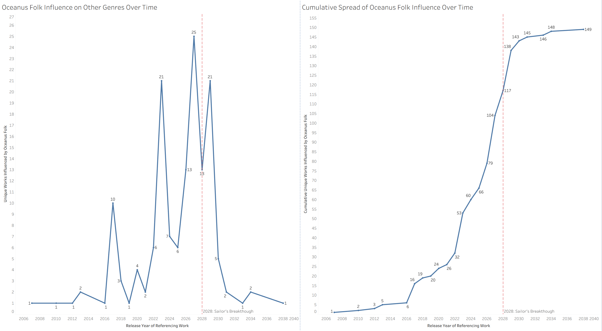
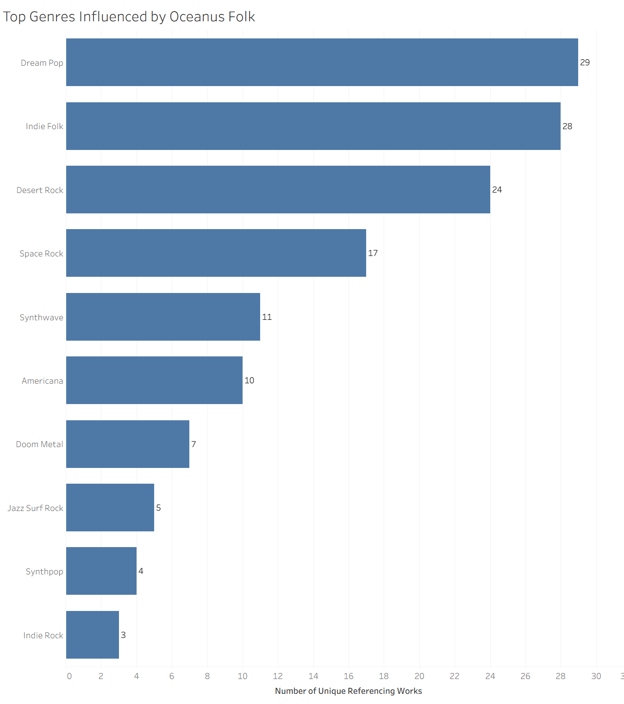
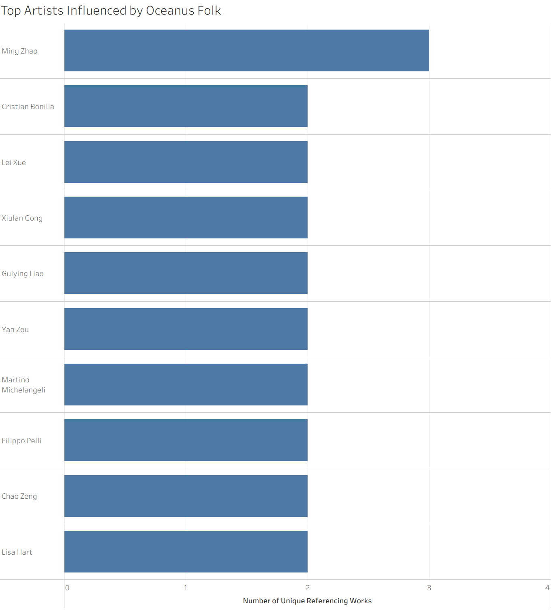
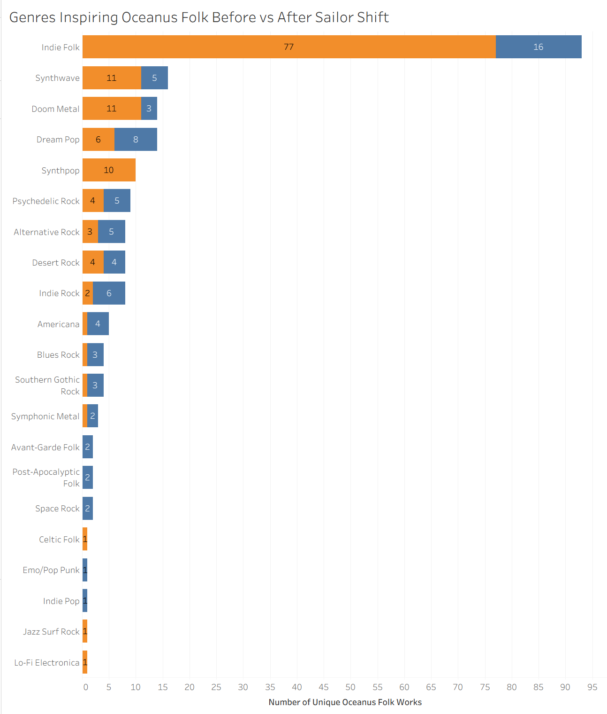
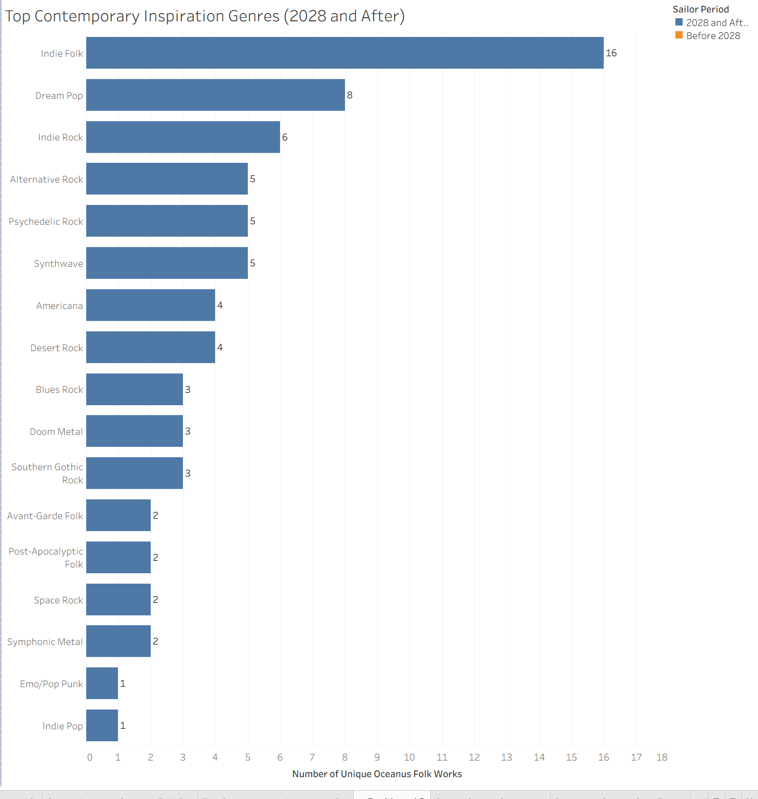
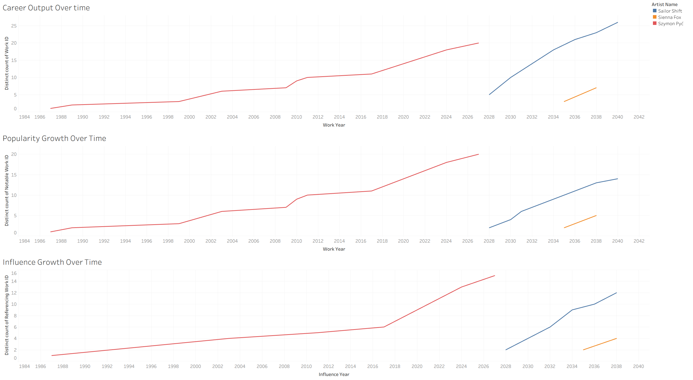
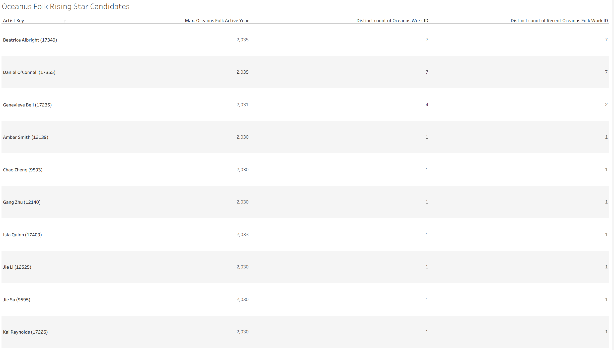

## Overview

This guide explains how to interact with the interactive network graph generated for this project and provides technical instructions on how to embed the exported Sigma.js HTML file into a Quarto website.

## Part 1: Navigating the Interactive Graph

The network graph provides a dynamic view of the Sailor Shift's influence in the music industry as well as the Oceanus Folk ecosystem. Use the following controls to explore the data:

### Basic Navigation

- **Zooming:** Use your mouse scroll wheel or the `+` and `-` buttons in the control panel to zoom in and out of the network.
- **Panning:** Click and drag anywhere on the background canvas to move around the graph.
- **Hovering:** Hover over any node (circle) to reveal its label (e.g., Artist Name, Song Title).
- **Clicking:** Click on a specific node to highlight its direct connections (edges) while dimming the rest of the network. Click the background canvas to clear the selection.

### Using the Search and Filter Panel

The control panel (typically located on the right or left side of the screen) allows for advanced exploration:

- **Search by Node:** Use the search bar to find a specific artist or song. The graph will center on your search result.
- **Group Selection:** If the data was partitioned in Gephi (e.g., by Node Type or Modularity Class), use the dropdown menus to filter the network to display only specific groups.

## Part 2: Using the Question 2 Dashboard — Spread and Evolution of Oceanus Folk

This dashboard explains how **Oceanus Folk** spread through the wider music industry, which genres and artists were most influenced by it, and how the genre itself changed after the rise of **Sailor Shift**.

### Dashboard Components

The Question 2 dashboard is divided into three main analytical views:

- **Influence Over Time:** shows whether Oceanus Folk spread gradually or in bursts.
- **Top Genres and Artists Influenced by Oceanus Folk:** shows which genres and artists most frequently adopted Oceanus Folk influence.
- **Genres Inspiring Oceanus Folk (Before vs After Sailor Shift):** shows how Oceanus Folk’s own inspirations changed before and after Sailor Shift’s 2028 breakthrough.

### How to Read the Dashboard

#### 1. Influence Over Time

This section usually contains: \* a **yearly trend line** showing the number of unique works influenced by Oceanus Folk each year \* a **cumulative line** showing how Oceanus Folk influence built up over time

**How to use it:** \* **Hover** over each point to see the year and value. \* Look for whether the line rises steadily or shows sudden spikes. \* Use the annotated **2028 reference line** (if included) to compare the spread before and after Sailor Shift’s breakthrough.

**What it helps answer:** \* Was Oceanus Folk influence gradual or intermittent? \* Did its spread accelerate after Sailor Shift’s rise?

#### 2. Top Genres Influenced by Oceanus Folk

This section ranks the genres whose works most frequently reference or borrow from Oceanus Folk.

**How to use it:** \* **Hover** over each bar to see the genre name and count. \* Compare the bar lengths to identify which genres were influenced most strongly. \* Read the highest-ranked genres first to identify the main receiving communities.

**What it helps answer:** \* Which genres most strongly adopted Oceanus Folk? \* Did the genre mostly spread to similar folk-based genres, or did it expand into more distant styles?

#### 3. Top Artists Influenced by Oceanus Folk

This section ranks artists whose works show the strongest Oceanus Folk influence.

**How to use it:** \* **Hover** over a bar to view the artist name and number of influenced works. \* Where available, use the filter panel to focus on solo artists or compare across all performers. \* Interpret the bars as showing **distinct influenced works**, not just raw reference counts.

**What it helps answer:** \* Which artists most strongly absorbed Oceanus Folk into their own music? \* Is the influence concentrated in a few artists or spread across many?

#### 4. Genres Inspiring Oceanus Folk Before vs After Sailor Shift

This section compares the genres that influenced Oceanus Folk **before 2028** and **from 2028 onward**.

**How to use it:** \* Use the color legend to distinguish **Before 2028** and **2028 and After**. \* Compare the two bars for each genre to see whether that inspiration source increased or decreased after Sailor Shift’s rise. \* Read from top to bottom to see which genres remained dominant and which newly emerged.

**What it helps answer:** \* How did Oceanus Folk change after Sailor Shift became successful? \* Which genres are its strongest contemporary inspirations?

#### 5. Top Contemporary Inspiration Genres

This section isolates the **post-2028** period and ranks the genres most strongly influencing Oceanus Folk in the present era.

**How to use it:** \* Hover over each bar for the exact count. \* Focus on the top few genres to identify the clearest present-day inspiration sources. \* Use this together with the before/after chart to distinguish long-term roots from newer influences.

------------------------------------------------------------------------

### Suggested Interpretation Flow for Question 2

A good way to explore the Question 2 dashboard is:

1.  Start with **Influence Over Time** to understand whether the spread was gradual or intermittent.
2.  Move to **Top Genres Influenced by Oceanus Folk** to see where the influence spread outward.
3.  Check **Top Artists Influenced by Oceanus Folk** to identify the human side of that spread.
4.  Finish with **Genres Inspiring Oceanus Folk Before vs After Sailor Shift** to understand how the genre evolved internally.

------------------------------------------------------------------------

## Part 3: Using the Question 3 Dashboard — Rising Star Profile and Prediction

This dashboard compares the careers of three artists to define what a **rising star** looks like in the dataset, then uses that profile to predict the next Oceanus Folk stars.

### Dashboard Components

The Question 3 dashboard is divided into four main views:

- **Career Output Over Time**
- **Popularity Growth Over Time**
- **Influence Growth Over Time**
- **Oceanus Folk Rising Star Candidates**

### How to Read the Dashboard

#### 1. Career Output Over Time

This chart shows how each selected artist’s body of work grows over time.

**How to use it:** \* **Hover** over a point on the line to see the year and cumulative number of works. \* Compare the steepness of each line: \* a steeper line means faster output growth \* a flatter line means slower or more gradual output growth \* Use the legend to identify which line belongs to which artist.

**What it helps answer:** \* Which artist had the fastest career expansion? \* Which artist built their catalog more steadily over time?

#### 2. Popularity Growth Over Time

This chart shows the cumulative growth of **notable works** over time.

**How to use it:** \* Hover over each point to see the cumulative number of notable works. \* Compare how quickly the lines rise: \* a fast-rising line indicates rapid recognition \* a slow-rising line suggests more gradual visibility \* Compare this chart with the output chart to see whether high productivity is translating into recognition.

**What it helps answer:** \* Which artists converted their releases into recognition most effectively? \* Did popularity rise gradually or through breakout moments?

#### 3. Influence Growth Over Time

This chart shows how much each artist influenced later works by others.

**How to use it:** \* Hover over each point to see cumulative referencing works. \* Compare the slope of the lines: \* a steep line indicates faster growth in influence \* a slow line indicates slower or longer-term accumulation of impact \* Compare this chart with the popularity chart to see whether influence follows after recognition.

**What it helps answer:** \* Which artist’s work began influencing others most strongly? \* Did influence grow immediately, or only after popularity increased?

#### 4. Oceanus Folk Rising Star Candidates

This table ranks recent Oceanus Folk artists using measures such as: \* total Oceanus Folk works \* recent Oceanus Folk works \* recent notable Oceanus Folk works \* latest active year

**How to use it:** \* Read the table from top to bottom after sorting by recent Oceanus Folk activity. \* Use **Recent Notable Oceanus Folk Works** as the main indicator of current breakout potential. \* Use **Recent Oceanus Folk Works** and **Max Active Year** as supporting indicators of momentum and recency. \* Exclude **Sailor Shift** when focusing on “next-generation” predictions, since she is already the benchmark star.

**What it helps answer:** \* Which Oceanus Folk artists currently show the strongest recent momentum? \* Who best fits the rising-star profile developed from the three comparison charts?

------------------------------------------------------------------------

### Suggested Interpretation Flow for Question 3

A good way to explore the Question 3 dashboard is:

1.  Begin with **Career Output Over Time** to compare release momentum.
2.  Move to **Popularity Growth Over Time** to see how recognition developed.
3.  Use **Influence Growth Over Time** to compare broader industry impact.
4.  Finally, check the **Oceanus Folk Rising Star Candidates** table to identify who best matches the rising-star profile.

------------------------------------------------------------------------

## General Interaction Tips for Tableau Dashboards

If the dashboard is embedded from Tableau, the following controls may be available:

- **Hovering:** reveals detailed values in the tooltip.
- **Clicking a bar or line:** may highlight or filter related data in the dashboard.
- **Legend selection:** allows you to isolate a category or artist visually.
- **Toolbar options:** depending on the embed, you may be able to use fullscreen, download, or share features.
- **Resetting the view:** click outside the selected mark or use the Tableau reset/revert option if available.